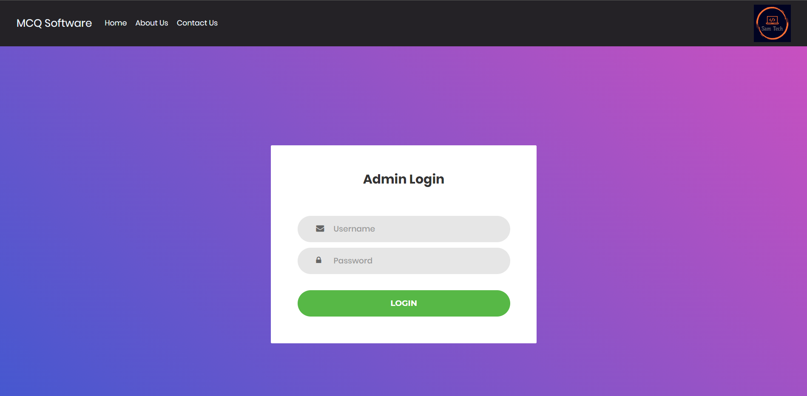
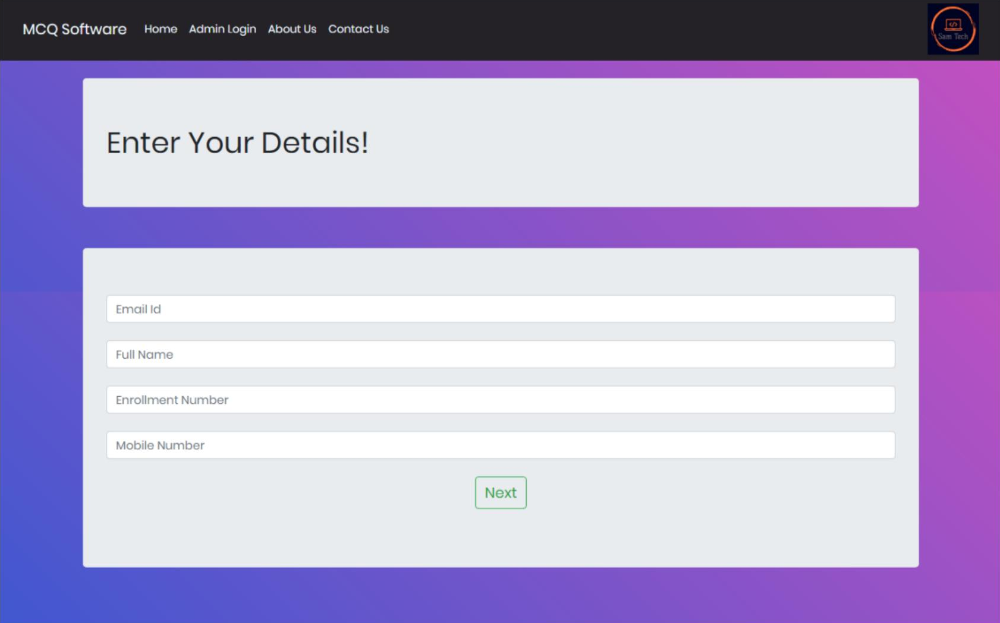
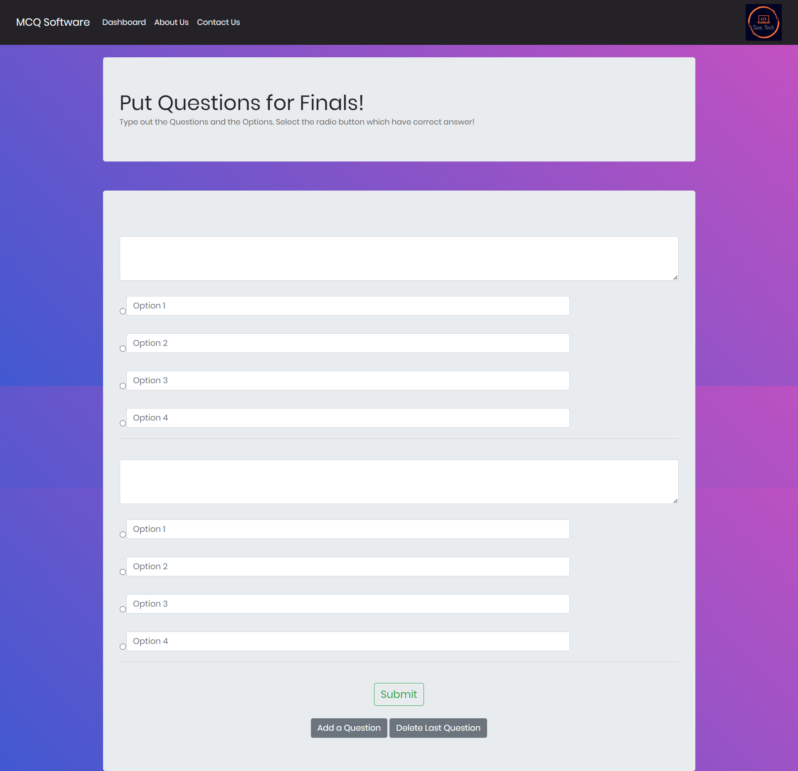
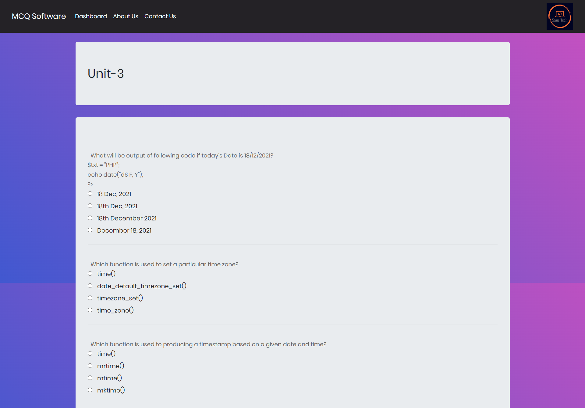
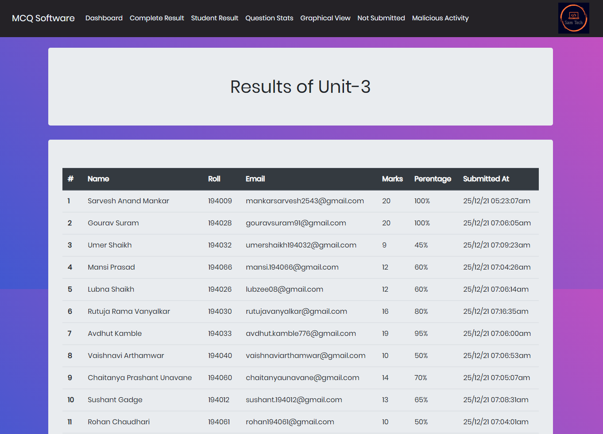
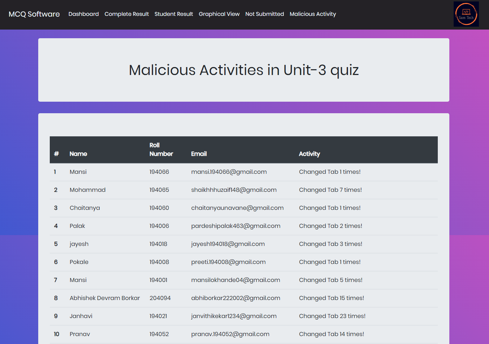
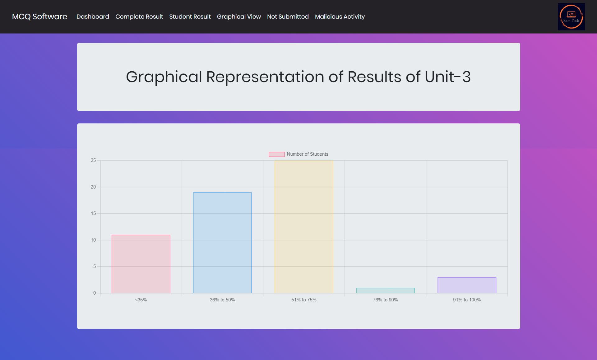

# MCQ-Examination

## Abstract
This project will fix the manual system's time-consuming issue. Additionally, the existing approach wastes the time of the examiners by having them check the test takers' answer sheets afterward; this programme eliminates this waste. Due to its user-friendliness and documentation, this application can even be used by users with limited computer expertise. The project's result will be that it saves the Examiner a lot of time and makes administering and maintaining quizzes more efficient and effective. The data will be properly examined by the examiner, and it will be simple to get a summary from the test.

## Objective

Due to the epidemic, educational institutions now offer daily lectures and tests on online platforms. A rapid and user-friendly online MCQ conducting platform is required. For those without much technical skills, this project will make doing testing simple. Nowadays, testing web applications like Google Forms, Testmoz, etc. is not simple. They take a lot of effort to learn how to utilise for people who are just getting started. 
So I created an MCQ Platform that makes running and managing MCQ Exams simple. It will cover things like getting a quiz from the examiner, making it available to students for a set amount of time, recording participant information, displaying data statistically to get a clear picture, displaying results to each participant, etc. This application will be much faster and more efficient than manual systems.

## Features
1.) Easy to Use. 
2.) Can handle a lot of users at a time. 
3.) Record malpractices. 
4.) Multiple result view for Examiner to have the best view over the progress of students. 
5.) Secure, faster and more efficient than Manual Systems. 

## Technology Stack
1.) HTML 
2.) CSS 
3.) JavaScript 
4.) PHP 
5.) MySQL 

## Software Requirements
1.) XAMPP 
2.) Any Browser 

## How to run this project?
1.) Install XAMPP. 
2.) Clone this repository in htdocs folder of XAMPP. 
3.) Start Apache and MySQL server. 
4.) Open phpMyAdmin and create a database named "mcq". 
5.) Import the mcq.sql file in the database. 
6.) Open any browser and type "localhost/MCQ-Examination". 

## Images

  

  

  

  

  

  

  

